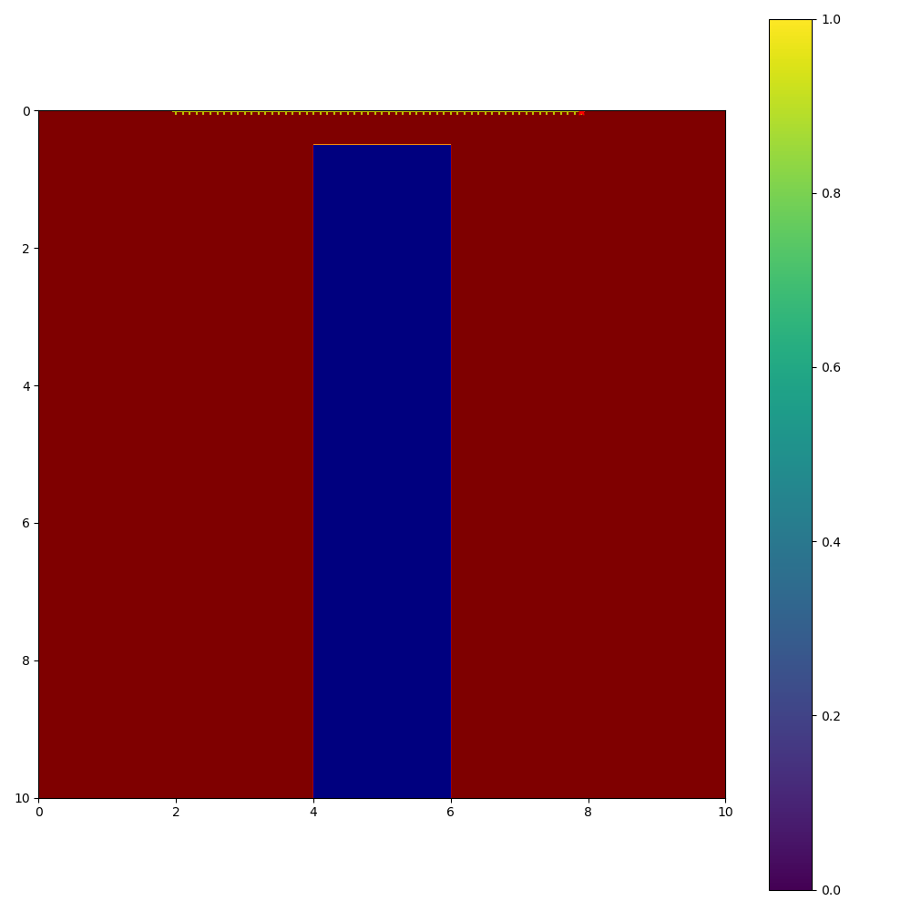
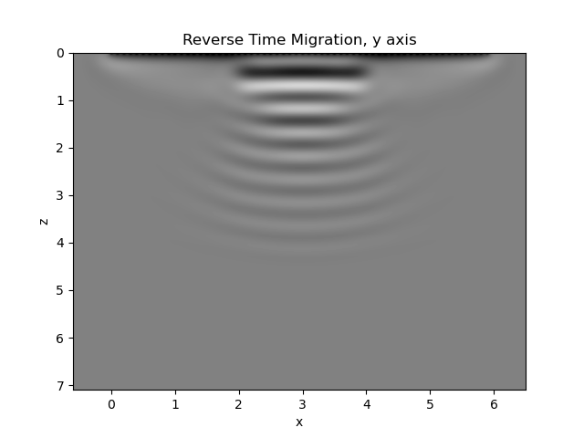

# TaichiRTM - Reverse Time Migration

<div align="left">
  
</div>

A GPU-accelerated Reverse Time Migration (RTM) program for seismic exploration using Taichi.

## Features

### Reverse Time Migration for Seismic Exploration
Reverse Time Migration (RTM) is a seismic wave inversion method that calculates reflection cross sections by combining (cross-correlation, convolution, etc.) seismic wave forward and backward propagation data using observed waveform and source information.

This program implements RTM using seismic wave forward/backward propagation modeling of P-SV waves and SH waves.

### Python + GPU Acceleration with Taichi
- **Multi-backend support**: CPU, CUDA GPU, Vulkan, OpenGL, Metal
- **No CUDA dependency**: Works on any system with Taichi support
- **Simple installation**: Just use pip or uv, no conda required

## Installation

### Using uv (Recommended)
```bash
# Install uv if not already installed
pip install uv

# Create virtual environment and install dependencies
uv sync
```

### Using pip
```bash
pip install .
# or with visualization support
pip install ".[visualization]"
```

## Quick Example

以下の3ステップでRTMを実行できます。サンプルデータのダウンロードから結果の可視化まで一連の流れを示します。

### Setup

```bash
# Install dependencies
uv sync
uv pip install matplotlib
```

### Step 1: Download Sample Data

```bash
uv run python examples/example_1st_step.py
```

サンプルデータ（npzファイル60個）がGitHub Releasesからダウンロードされ、`examples/npz_data/`に展開されます。

### Step 2: Run RTM Processing

```bash
uv run python examples/example_2nd_step.py
```

RTM処理を実行し、結果を`examples/results/data/`に保存します。また、個別の可視化画像を`examples/results/images/`に出力します。

### Step 3: Stack and Visualize Results

```bash
uv run python examples/example_3rd_step.py
```

全てのRTM結果をスタックし、最終的な可視化画像を生成します。

**出力例（rhoモデルと計算された断面図）:**




## Usage Guide

### Fluent API (Recommended)

コンテキストマネージャを使用して自動的にメモリをクリーンアップできます：

```python
import numpy as np
from src import ReverseTimeMigration, init_taichi

# Initialize Taichi with desired backend
# Options: 'cpu', 'gpu', 'cuda', 'vulkan', 'opengl', 'metal'
init_taichi(backend='cpu')

# Load your seismic data
npz = np.load('your_data.npz')

# Use context manager for automatic memory cleanup
with ReverseTimeMigration() as rtm:
    rtm.set_observed_data(observed_u, observed_v, observed_w)
    rtm.set_source(source_u, source_v, source_w, source_x)
    rtm.set_receivers(distance)
    rtm.set_frequency(fs)
    rtm.set_velocity_range(80, 300, 100)
    rtm.fix_velocity(velocity)
    rtm.set_boundary(50)
    rtm.set_memory(4.0)
    rtm.run()
    
    # Save results
    rtm.save_result(directory='results/data', savename='output')
```

### Backend Selection

Taichiの初期化時にバックエンドを選択できます：

```python
from src import init_taichi

# CPU backend (default, works everywhere)
init_taichi(backend='cpu')

# GPU backends (requires compatible hardware)
init_taichi(backend='gpu')      # Auto-select best GPU backend
init_taichi(backend='cuda')     # NVIDIA CUDA
init_taichi(backend='vulkan')   # Vulkan (cross-platform GPU)
init_taichi(backend='opengl')   # OpenGL
init_taichi(backend='metal')    # Apple Metal (macOS)
```

### Input Data Format
観測波形をnumpy配列形式で準備します（shape: `[num_receivers, num_samples]`）

### Visualization

可視化ユーティリティを使用して結果を表示できます：

```python
from src import create_visualization_data

# Get visualization-ready data
vis_data = create_visualization_data(rtm_instance, subtract_mean=True)

# Use with matplotlib
import matplotlib.pyplot as plt
plt.imshow(vis_data['u'], extent=vis_data['extent'], cmap='gray')
plt.show()
```

結果のスタッキングと可視化：

```python
from src import load_rtm_results, stack_rtm_images, compute_display_limits

# Load RTM results from directory
results = load_rtm_results('results/data')

# Stack multiple RTM images
stacked_data = stack_rtm_images(results, subtract_mean=True)

# Visualize
import matplotlib.pyplot as plt
vmin, vmax = compute_display_limits(stacked_data['w'])
plt.imshow(stacked_data['w'], cmap='gray', extent=stacked_data['extent'],
           vmin=vmin, vmax=vmax, aspect='auto')
plt.xlabel('x [m]')
plt.ylabel('z [m]')
plt.show()
```

## API Reference

### Main Classes

- `ReverseTimeMigration`: Main RTM class with Fluent API
  - `set_observed_data(u, v, w)`: Set observed velocity data
  - `set_source(u, v, w, loc)`: Set source wavelet and location
  - `set_receivers(loc)`: Set receiver locations
  - `set_frequency(fs)`: Set sampling frequency
  - `set_velocity_range(vmin, vmax, vstep)`: Set velocity estimation range
  - `fix_velocity(v)`: Set fixed velocity (skip estimation)
  - `set_boundary(frame)`: Set absorbing boundary width
  - `set_memory(gb)`: Set total memory budget in GB
  - `set_density(rho)`: Set density
  - `set_poisson_ratio(ratio)`: Set Poisson's ratio
  - `set_topography(heights)`: Set receiver heights for topography
  - `run()`: Execute RTM
  - `save_result(directory, savename)`: Save results to npz file
  - `get_results()`: Get imaging results as tuple
  - `get_axes_extent()`: Get axes extent for plotting

- `ForwardModeling`: Forward wave propagation
- `BackwardModeling`: Backward wave propagation

### Utility Functions

- `init_taichi(backend)`: Initialize Taichi with specified backend
- `reset_taichi()`: Reset Taichi runtime (releases all memory)
- `load_rtm_results(directory)`: Load RTM results from directory
- `stack_rtm_images(results, subtract_mean)`: Stack multiple RTM images
- `compute_display_limits(data)`: Compute symmetric display limits
- `create_visualization_data(rtm, subtract_mean)`: Prepare data for visualization
- `prepare_image_data(image, attenuate_region)`: Prepare image data for display
- `save_stacked_results(data, filepath)`: Save stacked RTM results

## Coordinate System

```
       Source   |---sensors--|
        o-------#---#---#---#--> x (wave propagation direction)
       /|                       
      / |
     /  |
    /   |
   y    | 
        z (vertical/depth direction)

Components:
  u: x-axis velocity
  v: y-axis velocity  
  w: z-axis velocity
```

## Contributions

We welcome issues and pull requests. Please feel free to contact us with bug reports, feature requests, etc.

## Future Prospects

We are working on:
- Support for different file formats (e.g., SEG-Y files)
- Additional imaging conditions
- Performance optimizations

## License

This project is licensed under the GNU Lesser General Public License v2.1 or later (LGPL-2.1-or-later).
